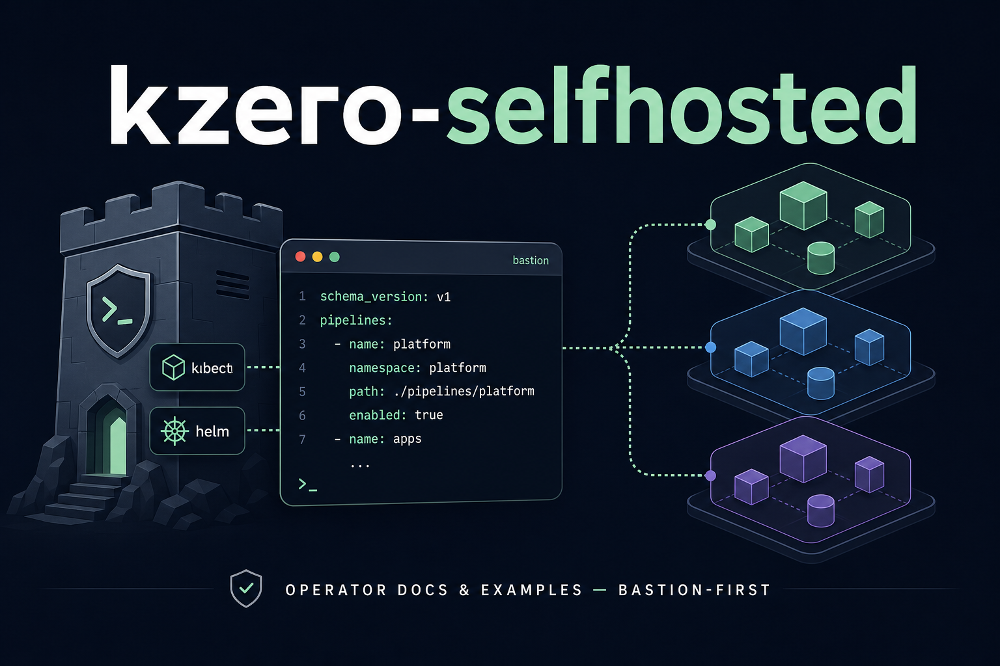

# kzero-selfhosted



[](https://github.com/hrodrig/kzero-selfhosted/releases)
[](https://github.com/hrodrig/kzero-selfhosted/releases)
[](https://opensource.org/licenses/MIT)
[](https://github.com/hrodrig/kzero/pkgs/container/kzero)
[](https://github.com/hrodrig/kzero)
[](https://gghstats.hermesrodriguez.com/hrodrig/kzero-selfhosted)

Operator-focused **extras** for **[kzero](https://github.com/hrodrig/kzero)** ([latest release](https://github.com/hrodrig/kzero/releases/latest)): how to run the CLI on a **bastion or automation host**, **`docker run`** notes, a **sample YAML**, and a **kind** smoke test. The **application** (Go CLI, tests, **`ghcr.io/hrodrig/kzero`**) lives in the **kzero** repo; **this** repo is documentation and examples only.

**Tested with kzero [v0.5.3](https://github.com/hrodrig/kzero/releases/tag/v0.5.3)** — including **`run.execution`** (shell / native / auto), **`run.color`**, **per-step retry** in live mode (**v0.5.2**), strictly **sequential** pipelines (**v0.5.3**, no **`run.worker_concurrency`**), **`kzero analyze`** plan output (`[down]` / `[up]`, **`Run execution:`**, **`Run color:`**, **`Retry:`**, **Deferred**), **Cluster validation** when kubeconfig loads, and **server-side dry-run** on native scale steps. Pipeline commands print **`Kubernetes target:`** before mutations. See **[CHANGELOG.md](CHANGELOG.md)** and the **[kzero CHANGELOG](https://github.com/hrodrig/kzero/blob/main/CHANGELOG.md)**.

**Releases here:** root **`VERSION`** and Git tags **`v<semver>`** on **`main`** name snapshots of **this** repository. Work in progress may land on **`develop`** first.

---

## What is in this repo (and what is not)

| In **kzero-selfhosted** | In **[hrodrig/kzero](https://github.com/hrodrig/kzero)** |
|-------------------------|----------------------------------------------------------|
| Operator README, **`run/docker`**, **`run/examples`** | CLI source, **`make release-check`**, unit tests |
| **kind** e2e manifests + **`make test-kind-e2e`** | **`ghcr.io/hrodrig/kzero`** distroless images |
| Lab counter image build for e2e only | Binaries, `.deb` / `.rpm`, GoReleaser releases |

**Not shipped here:** Docker Compose, in-cluster Helm chart for **kzero**, or a bundled **`kubectl`** / **`helm`** runtime. **kzero** is **not** an in-cluster workload — run it where **`kubeconfig`** already works.

---

## kzero is not self-contained (even with `run.execution: native`)

**kzero** orchestrates clusters from a **host** process. What you need on that host depends on config and **`run.execution`**:

| Config / step kind | Typical host tools |
|--------------------|-------------------|
| **`run.mode: dry-run`** | **kzero** only; with **`run.execution: native`**, scale steps use **server-side dry-run** (API validation, no persisted replica change) |
| **`kzero analyze`** | **kzero** only |
| **`deployment` / `statefulset`** with **`run.execution: native`** | **kzero** + valid **kubeconfig** (client-go scale/wait; no **`kubectl`** for those steps) |
| Same workloads with **`shell`** or **`auto`** (fallback) | **kzero** + **`kubectl`** on **`PATH`** (or **`command.kubectl`**) |
| **`release.*`** steps | **`helm`** + scripts under **`helm.workspace`** |
| **`custom:`**, phase hooks, per-step **`pre` / `post`** | **`/bin/sh`**; scripts often call **`kubectl`** themselves |
| **kind e2e in this repo** | **kzero**, **`kubectl`**, **kind**, **Docker**; live config uses **`run.execution: native`**; Postgres **`pre:`** hook still uses **`kubectl exec`** |

The published **[GHCR](https://github.com/hrodrig/kzero/pkgs/container/kzero)** image is **distroless** (only the **`kzero`** binary). It is fine for **`analyze`** / **`version`**. For **`live`** pipelines you either install **`kubectl`** / **`helm`** beside the container, use a **custom image**, or install **kzero** as a **native package** on the bastion ([kzero — Install or update](https://github.com/hrodrig/kzero/blob/main/README.md#install-or-update)).

Contract and schema: **[kzero SPECIFICATIONS](https://github.com/hrodrig/kzero/blob/main/docs/SPECIFICATIONS.md)** (including [**`run.execution`**](https://github.com/hrodrig/kzero/blob/main/docs/SPECIFICATIONS.md#workload-execution-backend-runexecution)).

---

## Table of contents

- [Where to start](#where-to-start)
- [Local e2e (kind)](#local-e2e-kind)
- [Repository layout](#repository-layout)
- [Policies](#policies)
- [License](#license)

---

## Where to start

| Goal | Start here |
|------|------------|
| **Install kzero** (binaries, packages, GHCR) | [kzero README — Install or update](https://github.com/hrodrig/kzero/blob/main/README.md#install-or-update) |
| **Production** `live` **down** / **up** / **reset** | Bastion or job runner: **kzero**, **kubeconfig**, **`kubectl`** and/or **`helm`** as your YAML requires; set **`run.execution`** (`shell`, `native`, or `auto`) — [kzero — First run](https://github.com/hrodrig/kzero/blob/main/README.md#first-run) |
| **`docker run`** ( **`analyze`** / **`version`** ) | [run/docker/README.md](run/docker/README.md) — examples use **`ghcr.io/hrodrig/kzero:v0.5.3`** |
| **Copy-paste sample config** | [run/examples/kzero.sample.yml](run/examples/kzero.sample.yml) |
| **Smoke test on a disposable cluster** | [testing/kind/README.md](testing/kind/README.md) — **`make test-kind-e2e`** |

---

## Local e2e (kind)

From the **repository root**, with **Docker**, **kind**, **kubectl**, and **kzero** [v0.5.3+](https://github.com/hrodrig/kzero/releases/tag/v0.5.3) on **`PATH`** (or **`KZERO_BIN`**):

```bash
make test-kind-e2e
```

**Workloads-only** (no **kzero** binary): **`make test-kind-workloads`**.

The full e2e script:

1. Creates a **kind** cluster and applies lab workloads in **`kzero-e2e`** (nginx **web**, Postgres-backed **counter**, **Redis**, **RabbitMQ**, **Postgres**, nginx **StatefulSet** + PVC, lightweight **obs** **Deployment**).
2. **Phase 1** — drives the counter **HTML UI** (0 → increment ×3 → 3).
3. **Phase 2** — **`kzero analyze`**, then **`kzero down`** (dry-run plan, then live) and **`kzero up`** using **`run.execution: native`** in [testing/kind/kzero-e2e.yaml](testing/kind/kzero-e2e.yaml); Postgres **`pre-down`** hook truncates **`e2e_scratch`** via **`kubectl exec`**.
4. **Phase 3** — UI count back to **0**.
5. **Phase 4** — deletes the cluster on exit.

Details, env vars, and manifest list: **[testing/kind/README.md](testing/kind/README.md)** · overview: **[testing/README.md](testing/README.md)**.

---

## Repository layout

| Path | Purpose |
|------|---------|
| **`run/`** | Operator overview — [run/README.md](run/README.md) |
| **`run/docker/`** | **`docker run`** examples ([run/docker/README.md](run/docker/README.md)) |
| **`run/examples/`** | **`kzero.sample.yml`** ([run/examples/README.md](run/examples/README.md)) |
| **`testing/kind/`** | kind cluster manifests, e2e configs, lab **counter** Dockerfile |
| **`testing/scripts/`** | **`kzero-kind-e2e.sh`** driver |
| **`assets/`** | README hero image |
| **`Makefile`** | **`make help`**, **`make test-kind-e2e`**, **`make test-kind-workloads`** |
| **`AGENTS.md`** | Scope and conventions for agents / contributors |
| **`CHANGELOG.md`** | **kzero-selfhosted** release history |

Application tests and **`make release-check`**: clone **[hrodrig/kzero](https://github.com/hrodrig/kzero)**.

---

## Policies

- **[AGENTS.md](AGENTS.md)** — scope, versioning, upstream pin.
- **[CONTRIBUTING.md](CONTRIBUTING.md)** — PR expectations.
- **[SECURITY.md](SECURITY.md)** — reporting vulnerabilities.
- **[CODE_OF_CONDUCT.md](CODE_OF_CONDUCT.md)** — community standards.

---

## License

See **[LICENSE](LICENSE)** (MIT).
